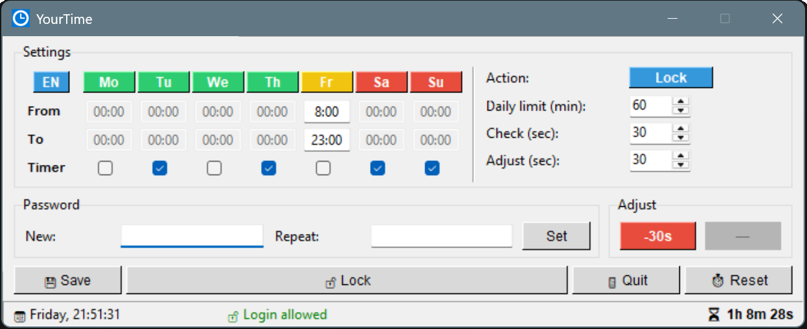

 YourTime


  > ☕ If it saves you nerves, time, or family arguments - a small support is always appreciated: \
  **Bitcoin:** `56YBrHBxgohqf5zs5TUS9KkAcqGDm`

  > ⚠️ **Friendly disclaimer** — YourTime can lock or log off your Windows session. If you misconfigure it (e.g. always-blocked times), it may cause repeated logouts recoverable only from Safe Mode or by manually removing the config/autostart entry. By using this tool you accept responsibility for your own configuration.

A lightweight Windows app that quietly enforces daily screen-time limits per user. Set allowed hours, a countdown timer, or block certain days entirely. When time is up the PC locks itself or logs the user off — no way around it without a password.
<div align="center">
  
</div>

## How it works

After starting, YourTime disappears into the system tray (clock icon, bottom-right corner of the taskbar).  
Double-click to open settings. Everything is password-protected so the person being limited can't just switch it off.

When remaining time enters the warning zone the window forces itself to the foreground and stays there.  
Closing or minimising it? It comes right back. The only way out is to wait — or enter the admin password.

---

## Features

- **Daily time limit** with persistent countdown — survives reboots
- **Per-day configuration** — always on, time window (e.g. 15:00–21:00), or fully blocked
- **Optional timer per day** — counts down only within the allowed window
- **Per-day daily limit** in minutes — independent spinbox per weekday
- **Autostart toggle** — ON/OFF button in the GUI writes/removes the `HKCU\...\Run` entry; also clears the `StartupApproved` disabled-flag so a manually deactivated entry always comes back enabled
- **Password protection** for the settings panel
- **System tray** — runs silently in the background
- **UI languages** — German · English · Russian (cycle button in settings)
- **Enforcement actions** — Lock workstation or Log off (cycle button in settings)
- **Quick-adjust buttons** — add or subtract seconds from the remaining timer when in the warning zone
- **Window stays in foreground** when time is running out

---

## Requirements

- Windows 10/11
- Python 3.10+

```bash
pip install pystray pillow
python backend.py
```

The app starts directly to the system tray — no window opens on launch.  
Find the icon in the taskbar notification area (bottom-right, may be hidden under the arrow).  
Double-click to open settings.

---

## Build standalone EXE

No Python needed on the target PC.

```bat
build.bat
```

Output: `dist/YourTime.exe` — copy the entire `dist` folder anywhere.

> **Note** — Windows Defender may flag PyInstaller-built executables as suspicious.  
> Add an exclusion for the `dist` folder, or right-click → Properties → Unblock.

---

## First-time setup

1. Double-click the tray icon to open settings
2. Click **Unlock** — no password yet, just confirm
3. Configure days, time windows, and daily limits
4. Toggle **Autostart → ON** so YourTime starts with Windows
5. Set an admin password so the target user can't change settings
6. Click **Save**

From this point on, YourTime enforces the rules silently.

---

## Configuration

Settings are stored in `config.json` next to the executable.  
A default file is created on first run. See `config.example.json` for the full schema.

| Field | Description |
|---|---|
| `target_user` | Windows username to enforce — set automatically on Save |
| `check_interval_seconds` | How often the watchdog re-evaluates the situation |
| `extend_seconds` | Step size for the quick-adjust buttons |
| `action` | `lock` or `logoff` when time runs out |
| `allowed_times` | Per-day rules: day, enabled, time window, use_timer on/off, limit_minutes |

---

## Project structure

```
YourTime/
├── backend.py          Business logic, watchdog thread, autostart helpers, entry point
├── frontend.py         Tkinter GUI
├── definitions.py      Constants, colours, i18n strings, registry paths
├── build.bat           PyInstaller one-click build
├── config.example.json Example config schema
└── img/
    ├── icon_512.png    App icon (for this readme)   
    ├── icon.ico        App icon (window + tray)
    └── screenshot.png  Screenshot for this README
```

---

## License

**MIT License with Commons Clause**

Free to use, modify, and share.  
You may **not** sell this software or offer it as a paid product or service.  
If you build something on top of it — same rules apply.

*In short: use it freely, don't make money off it without asking first.*

<details>
<summary>Full license text</summary>

MIT License  
Commons Clause License Condition v1.0

The Software is provided under the MIT License.  
The following condition is added:

Without the express written permission of the author, no person or organization may sell, rent, or otherwise commercialize the Software or a Substantial Portion of it.  
"Sell" means providing the Software to third parties for a fee, where the primary value derives from the Software's functionality.

</details>
