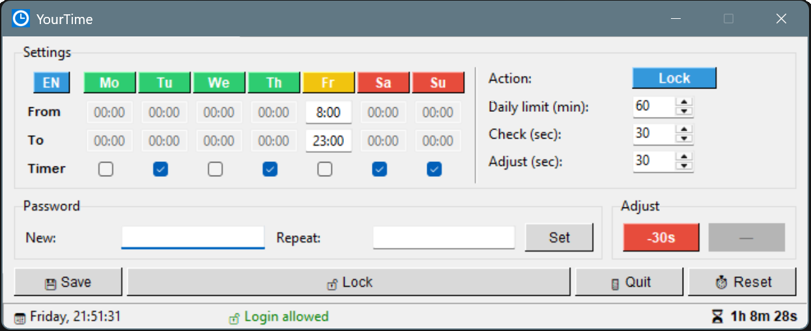

 YourTime

  > ⚠️ **Disclaimer** — YourTime can lock or log off your Windows session.
  > Misconfiguration (e.g. always-blocked times) may cause repeated logouts,
  > recoverable only from Safe Mode or by removing the config / autostart entry.
  > By using this tool you accept responsibility for your own configuration.

  > ☕ If it saves you nerves or family arguments — a cup of tea is appreciated: \
  **Bitcoin:** `56YBrHBxgohqf5zs5TUS9KkAcqGDm`

A lightweight Windows app that quietly enforces daily screen-time limits for the
current user. Set allowed hours, a countdown timer, or block certain days entirely.
When time is up the PC locks itself or logs the user off — no way around it without a password.

<div align="center">
  
</div>

## How it works

After starting, YourTime hides in the system tray (bottom-right corner of the taskbar).
Double-click the icon to open the settings window.
Everything is password-protected so the person being limited cannot switch it off.

When remaining time enters the warning zone the window forces itself to the foreground
and stays there. Closing or minimising it brings it right back.
The only exit is to wait — or enter the admin password.

---

## Features

- **Daily time limit** with persistent countdown — survives reboots
- **Per-day configuration** — always on, time window (e.g. 15:00–21:00), or fully blocked
- **Optional timer per day** — counts down only within the allowed window
- **Per-day daily limit** in minutes — independent spinbox per weekday
- **Autostart toggle** — writes/removes `HKCU\...\Run`; also clears the `StartupApproved` flag
- **Password protection** for the settings panel
- **System tray** — runs silently in the background
- **UI languages** — German · English · Russian (cycle button)
- **Enforcement actions** — Lock workstation or Log off (cycle button)
- **Quick-adjust buttons** — add or subtract one cycle from the remaining timer
- **Window stays in foreground** when time is running out

---

## Requirements

- Windows 10 / 11
- Python 3.10+

```bash
pip install pystray pillow
python backend.py
```

The app starts directly to the system tray — no window on launch.
Find the icon in the notification area (bottom-right, may be hidden under the arrow).
Double-click to open settings.

---

## Build standalone EXE

No Python needed on the target PC.

```bat
build.bat
```

Output: `dist\YourTime.exe` — copy the entire `dist` folder anywhere.

> **Note** — Windows Defender may flag PyInstaller executables as suspicious.
> Add an exclusion for the `dist` folder, or right-click → Properties → Unblock.

---

## First-time setup

1. Double-click the tray icon to open settings
2. Click **Unlock** — no password yet, just confirm
3. Configure days, time windows, and daily limits
4. Toggle **Autostart → ON**
5. Set an admin password

---

## Configuration

Settings are stored in `config.json` next to the executable.
A default file is created on first run. See `config.example.json` for the full schema.

| Field | Description |
|---|---|
| `takt_seconds` | Watchdog cycle in seconds: saves usage and checks warn/enforce threshold every N seconds (default 30) |
| `action` | `lock` or `logoff` when time runs out |
| `password_hash` | SHA-256 hash of the admin password (empty = no protection) |
| `allowed_times` | Per-day rules: `days`, `enabled`, `start`/`end` window, `use_timer`, `limit_minutes` |

---

## Project structure

```
YourTime/
├── backend.py           Config I/O, scheduling, watchdog, AppController, entry point
├── frontend.py          Tkinter GUI (requires backend.AppController)
├── definitions.py       All constants: layout, colours, timings, i18n strings
├── build.bat            PyInstaller one-click build
├── config.example.json  Example config schema
└── img/
    ├── icon_512.png     App icon (README only)
    ├── icon.ico         App icon (window + tray)
    └── screenshot.png   README screenshot
```

---

## License

**MIT License with Commons Clause**

Free to use, modify, and share.
You may **not** sell this software or offer it as a paid product or service.
If you build on top of it — same rules apply.

<details>
<summary>Full license text</summary>

MIT License
Commons Clause License Condition v1.0

The Software is provided under the MIT License.
The following condition is added:

Without the express written permission of the author, no person or organization may sell,
rent, or otherwise commercialize the Software or a Substantial Portion of it.
"Sell" means providing the Software to third parties for a fee, where the primary value
derives from the Software's functionality.

</details>

---

Keywords: Screen-Time Control, Parental Control, Mental Health
